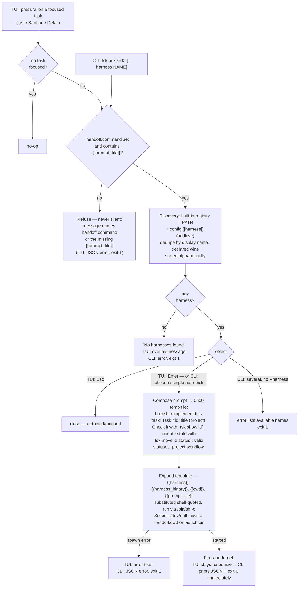

# Ask AI — Feature Flow

Derived from `behavior.feature` (18 scenarios). Two entry points (TUI key `a`,
CLI `tsk ask`) share one core: discovery → prompt composition → config-driven,
non-blocking handoff.

