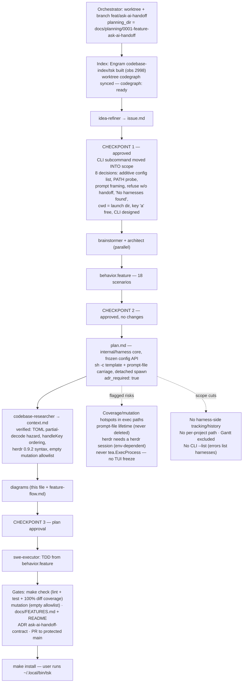

# Ask AI — Planning Process Flow (run `ask-ai-handoff`)

Feature-aware record of this planning run: real checkpoints, the decisions taken
for this change, and the gates waiting at the end.

Note: `RISK` and `CUT` are annotations, not pipeline stages — they were flagged
during planning and must survive into implementation.
